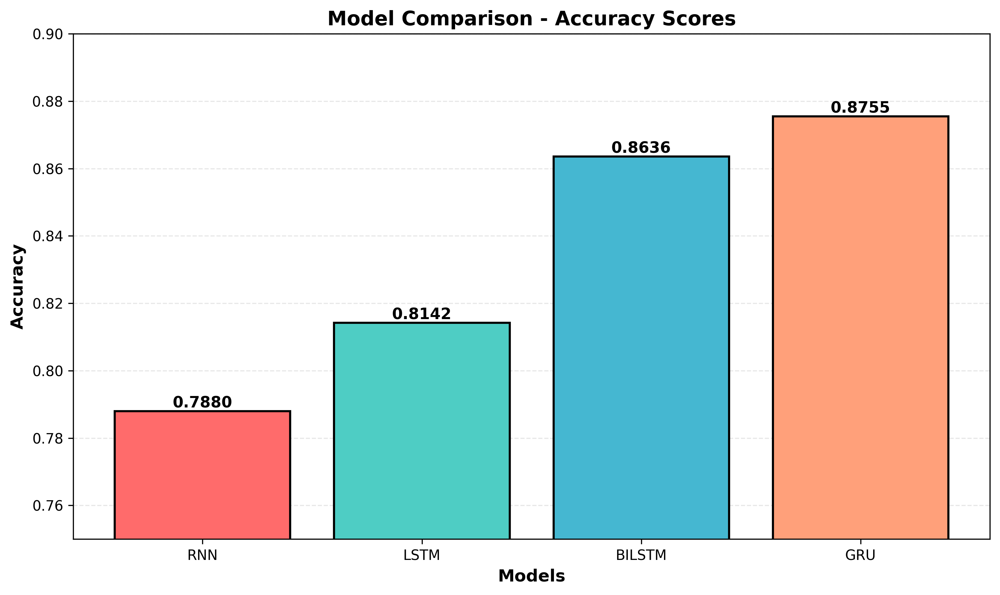
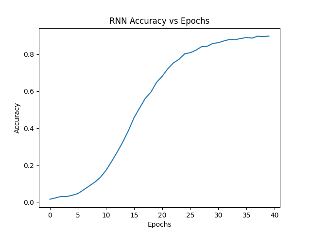
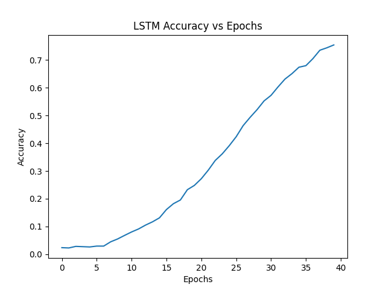
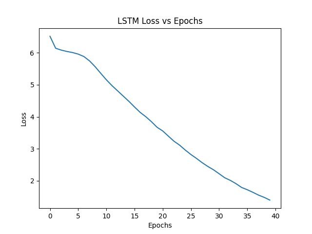
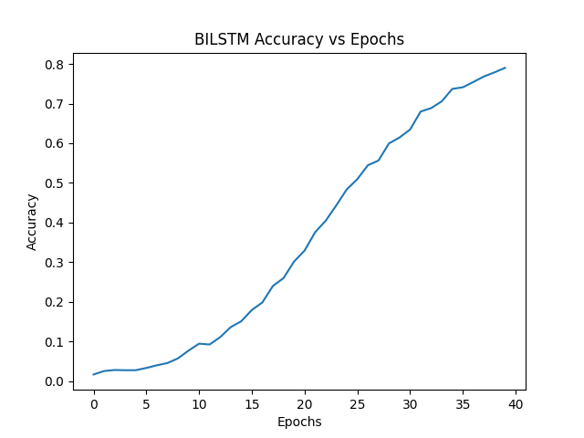
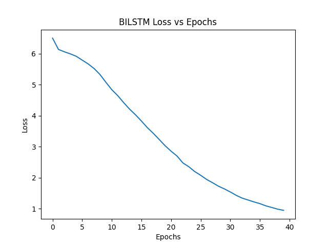
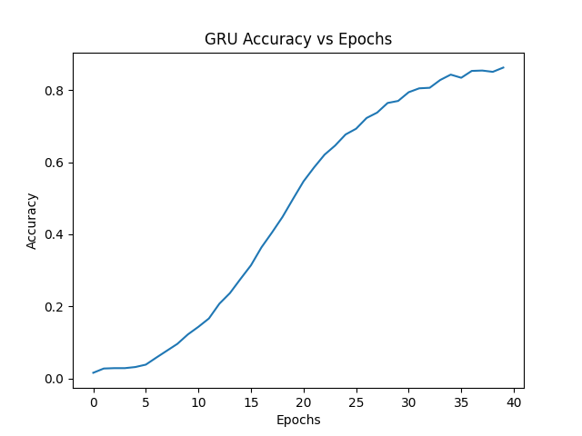
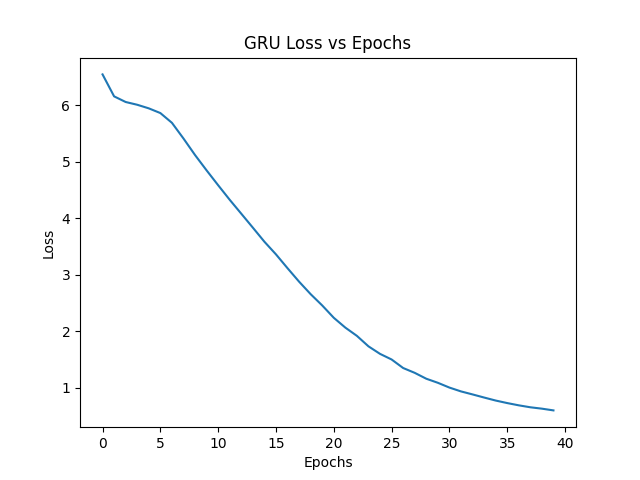

# Next Word Predictor

A deep learning project comparing 5 neural network architectures (RNN, LSTM, BiLSTM, GRU, Transformer) for predicting the next word in a sequence.

## Installation

```bash
git clone https://github.com/yourusername/NextWordPredictor.git
cd NextWordPredictor

# Create virtual environment
python -m venv venv
venv\Scripts\activate  # On Windows
source venv/bin/activate  # On macOS/Linux

# Install dependencies
pip install -r requirements.txt
```

## Quick Start

### Training

Edit `train.py` and set the model:
```python
MODEL_NAME = "lstm"  # Options: rnn, lstm, bilstm, gru, transformer
```

Then run:
```bash
python train.py
```

### Prediction

```python
from utils.predict import predict_next_word
from tensorflow.keras.models import load_model
import pickle

model = load_model('saved_models/lstm.h5')
with open('saved_models/tokenizer.pkl', 'rb') as f:
    tokenizer = pickle.load(f)

next_word = predict_next_word(model, tokenizer, "hello world", max_len=50)
print(next_word)
```

## Model Comparison

| Model | Parameters | Accuracy | Speed | Memory | Best For |
|-------|-----------|----------|-------|--------|----------|
| RNN | ~250K | Low | Fast | Low | Quick baseline |
| LSTM | ~480K | Medium | Medium | Medium | Sequence learning |
| BiLSTM | ~960K | High | Slow | High | Bidirectional context |
| GRU | ~360K | High | Fast | Medium | Efficient sequences |


## Training Results



### RNN



### LSTM



### BiLSTM



### GRU




## Project Structure

```
NextWordPredictor/
├── train.py                  # Training script
├── app.py                    # Streamlit web app
├── requirements.txt          # Dependencies
├── data/
│   └── dataset.txt          # Training dataset
├── models/
│   ├── rnn_model.py
│   ├── lstm_model.py
│   ├── bilstm_model.py
│   ├── gru_model.py
├── preprocessing/
│   └── preprocess.py        # Data preprocessing
├── utils/
│   └── predict.py           # Prediction function
└── saved_models/             # Trained models
    ├── rnn.h5
    ├── lstm.h5
    ├── bilstm.h5
    ├── gru.h5
    ├── tokenizer.pkl
    └── config.pkl
```

## Configuration

```python
# Training
Batch Size: 64
Optimizer: Adam (lr=0.001)
Loss: Categorical Crossentropy
Epochs: RNN(25), LSTM(45), BiLSTM(55), GRU(45)

# Model
Embedding Dim: 128
Hidden Units: 150
Dropout: 0.3
```

## Requirements

- Python 3.8+
- TensorFlow 2.10+
- NumPy
- Keras
- Pandas
- Streamlit (for web interface)

## License

MIT License

## Author

Your Name - [GitHub](https://github.com/yourusername)
